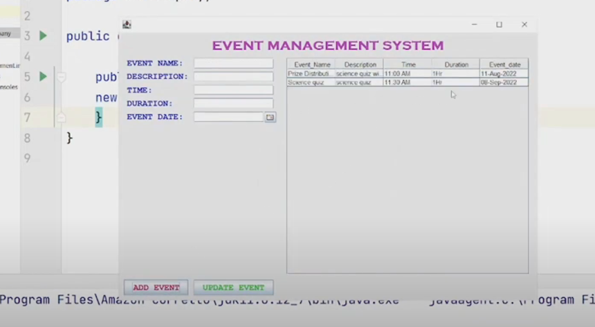
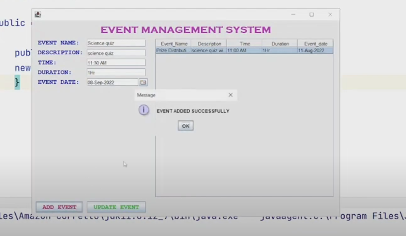

# EventManagementSystem

## Overview
The Event Management System is a Java-based desktop application built using Swing. It allows users to manage events with features such as adding, updating, and viewing event details.

## Features
- Add events with name, description, time, duration, and date.
- Update existing event details.
- View and manage events in a tabular format.
- Database integration for persistent storage.

## Screenshots
### Main Interface

### Adding an Event

### Database View

## Technologies Used
- Java Swing for UI
- MySQL for database
- IntelliJ IDEA GUI Designer

## How to Run
1. Clone the repository.
2. Import the project into IntelliJ IDEA.
3. Ensure you have a MySQL database setup with the schema provided in `resources/database.sql`.
4. Run the `Main.java` file.
